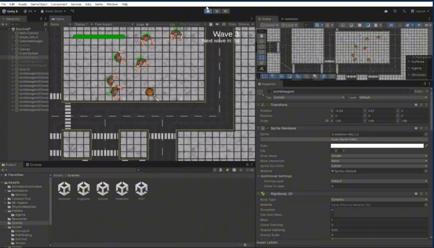
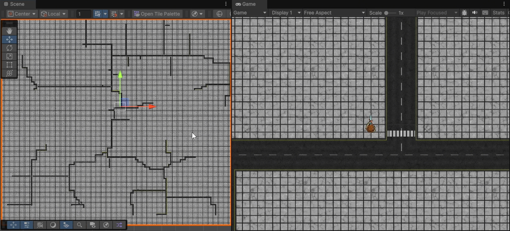

# Games and Artificial Intelligence Techniques (COSC2527/3144) Semester 1 2025 - Assignment 3
This is the README file for Assignment 3 in Games and Artificial Intelligence Techniques.
Team Members: Christian Nieves, Philip Kim, Paul Johny Mampilly

Image 1: The game as shown includes AI Zombie Agents with their own ML scripts, which follow the player

Image2: A modified A* Algorithm was used to create the roads.

Instructions:
- Open this file in unity to access the game
- "Survival" Scene is the main scene with "zombie spawner" activated to spawn zombies around player
- "Terrain" is a test generation file.

Saved models:
- ZombieBrain.onnx zombie trained file in /Assets
- BruteZombieBrain.onnx brute zombie trained file in /Assets
- PlayerBehaviour.onx trained file in /Assets
